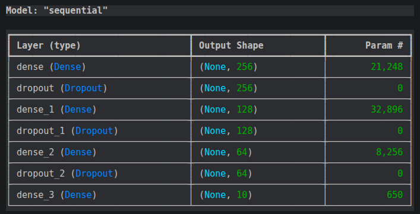
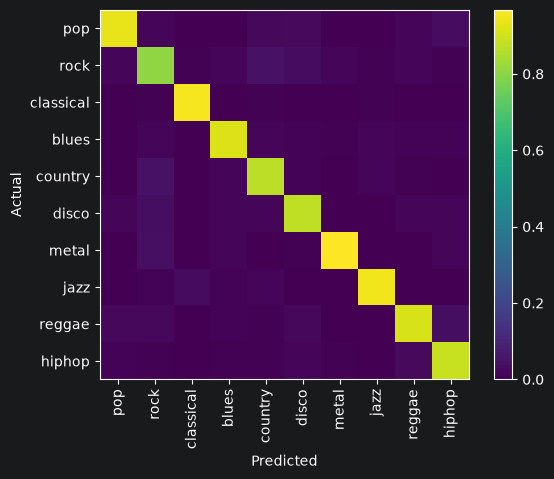
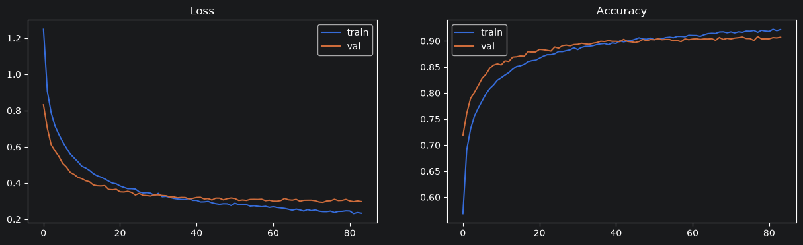

# ROSiS - Vaja 7 (Nevronske mreže 1)

## Izbrani parametri za nalaganje signala

Med ekstrakcijo značilk sem posamezne signale razdelil na 4s, 2s in 1s dele. 
To sem dosegel tako da sem signal preprosto delil na 7, 14 in 28 delov, saj so vsi signali bili dolžine 28s.

## Izbrane metode za določitev značilnic
    
### Zero crossing rate

**zero_crossing_rate** - Metoda prešteje kolikokrat signal prečka os x (amplituda = 0).

Parametri:

- ***y*** - signal
- ***hop_length*** - število vzorcev med zaporednima oknoma; nastavljeno na `sr/4`

### Tempo

**tempo** - Ocena tempa signala v BPM (Beats Per Minute).

Parametri:

- ***y*** - signal
- ***sr*** - vzorčevalna frekvenca

### MFCC, Delta, Delta-delta

**MFCC** - Mel-frekvenčni kepstralni koeficienti opisujejo spektralno ovojnico zvoka na mel skali, ki posnema človeško zaznavo frekvenc.

Parametri:

- ***y*** - signal
- ***sr*** - vzorčevalna frekvenca
- ***n_mfcc*** - število koeficientov
- ***n_fft*** - velikost FFT okna (512)
- ***hop_length*** - korak med okni (160 vzorcev)
- ***window*** - oblika okna (Hammingovo okno velikosti 512)
- ***fmin*** - spodnja frekvenca (300 Hz)
- ***fmax*** - zgornja frekvenca (8000 Hz)
- ***n_mels*** - število mel filtrov (128)

\pagebreak

**Delta** - Prvi odvod MFCC koeficientov skozi čas - opisuje kako se barva zvoka spreminja.

Parametri:

- ***mffc*** - Mel-frekvenlni kepstralni koeficienti

**Delta-delta** - Drugi odvod MFCC koeficientov - opisuje pospešek spremembe barve zvoka.

Parametri:

- ***mffc*** - Mel-frekvenlni kepstralni koeficienti
- ***order*** - red odvoda

Za vse tri značilke omenjene v tem podpoglavju, sem za njih izračunal standardni odklon ter povprečje in jih dal v vektor značilk. 

### Chroma STFT

**chroma_stft** - Izračuna kromatogram iz signala.

Parametri:

- ***y*** - signal
- ***sr*** - vzorčevalna frekvenca
- ***n_fft*** - velikost FFT okna (512)

Za značilko omenjeno v tem podpoglavju, sem izračunal standardni odklon ter povprečje in jih dal v vektor značilk.

### Tonnetz

**tonnetz** - Predstavlja tonalne odnose med zvoki. Dobro opisuje harmonično strukturo.

Parametri:

- ***y*** - harmonična komponenta signala (pridobljena iz signala z `librosa.effects.harmonic`)
- ***sr*** - vzorčevalna frekvenca

Za značilko omenjeno v tem podpoglavju, sem izračunal standardni odklon ter povprečje in jih dal v vektor značilk.

\pagebreak

### Spectral contrast

**spectral_contrast** - Meri razliko med energijskimi vrhovi in dolinami v 7 frekvenčnih pasovih spektra. Visok kontrast nakazuje glasne in tihe dele (npr. metal), nizek kontrast pa enakomerno porazdeljeno energijo (npr. klasična glasba).

Parametri:

- ***y*** - signal
- ***sr*** - vzorčevalna frekvenca
- ***n_fft*** - velikost FFT okna (512)

Za značilko omenjeno v tem podpoglavju, sem izračunal standardni odklon ter povprečje in jih dal v vektor značilk.

### RMS

**rms** - Koren povprečja kvadratov vzorcev (Root Mean Square). Meri povprečno glasnost signala skozi čas.

Parametri:

- ***y*** - signal

Za značilko omenjeno v tem podpoglavju, sem izračunal standardni odklon ter povprečje in jih dal v vektor značilk.

\pagebreak

## Hiperparametri nevronske mreže

### Arhitektura

| Plast | Tip | Nevroni | Aktivacija |
|-------|-----|---------|------------|
| Vhod | Input | 82 | - |
| Skrita 1 | Dense | 256 | ReLU |
| Regularizacija 1 | Dropout | - | 0.3 |
| Skrita 2 | Dense | 128 | ReLU |
| Regularizacija 2 | Dropout | - | 0.3 |
| Skrita 3 | Dense | 64 | ReLU |
| Regularizacija 3 | Dropout | - | 0.2 |
| Izhod | Dense | 10 | Softmax |

Arhitektura sledi principu postopnega zmanjševanja (256 → 128 → 64), kar modelu omogoča da se postopoma nauči vse bolj abstraktnih reprezentacij značilk pred končno klasifikacijo.

**Aktivacijska funkcija ReLU** (Rectified Linear Unit) je bila izbrana za skrite plasti ker ne trpi za problemom izginjajočega gradienta in je računsko učinkovita.

**Aktivacijska funkcija Softmax** na izhodni plasti pretvori vrednosti v verjetnosti za vsakega od 10 žanrov - vsota vseh izhodni verjetnosti je vedno 1.

**Dropout** med učenjem naključno "ugasne" določen delež nevronov, kar preprečuje prekomerno učenje (overfitting). Vrednost 0.3 pomeni da se 30% nevronov ugasne v vsaki iteraciji. Pri zadnji plasti je vrednost manjša (0.2) ker bližje izhodu ne želimo preveč motiti že naučenih reprezentacij.

### Optimizator in izgubna funkcija

- **Optimizator:** Adam z hitrostjo učenja `learning_rate = 0.001` - Adam adaptivno prilagaja hitrost učenja za vsak parameter posebej, kar vodi do hitrejše konvergence kot standardni SGD.
- **Izgubna funkcija:** `SparseCategoricalCrossentropy` - primerna za klasifikacijo z več razredi kjer so oznake cela števila (0-9).
- **Metrika:** `SparseCategoricalAccuracy` - meri delež pravilno klasificiranih vzorcev.

### Parametri učenja

- **Število epoh:** 150 - zgornja meja, učenje se samodejno prekine prej z early stopping.
- **Velikost paketa (batch size):** 32 - kompromis med stabilnostjo gradientov in hitrostjo učenja.
- **Early stopping:** monitor `val_loss`, patience = 10 - učenje se prekine če se validacijska izguba 10 epoh zapored ne izboljša.
- **Model checkpoint:** shranjuje samo najboljše uteži glede na `val_loss` - po končanem učenju se naložijo najboljše uteži.

### Tabela Summary



## Pravilnosti klasifikacije

 \[H]

## Metrike izgube skozi učenje

 \[H]

Grafa prikazujeta metriko izgube (loss) in natančnosti (accuracy) skozi epohe učenja na učni in validacijski množici.

```text
Acc train NN: 0.988
Acc test NN: 0.906
```
